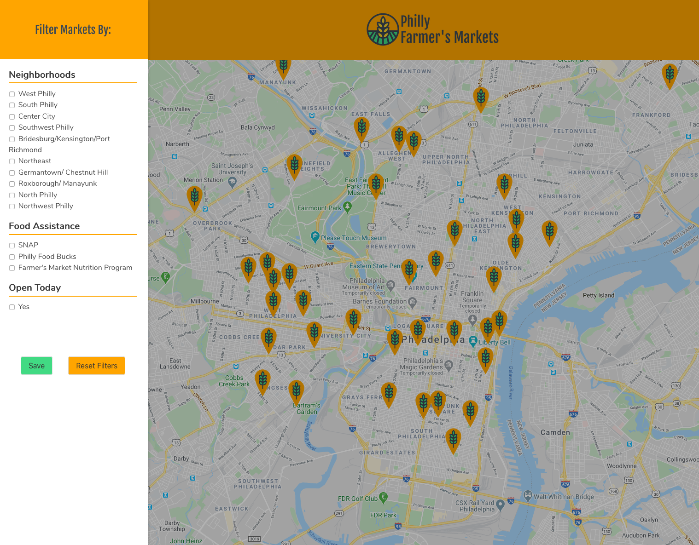

# Philly Farmer's Markets

## General Information

A small project I built to play around with datasets from [OpenDataPhilly](https://www.opendataphilly.org). The app displays farmer's markets in Philadelphia, PA, and can be filtered by neighborhoods, food assistance, and whether or not they are open today.

## Screenshot




## Technologies 

- React 
- Context API 
- Google Maps API 
- Bulma CSS framework

## To Dos 

- I started refactoring to add the `useReducer` hook to see how `Context` and `useReducer` might be used together usefully. 
- Find a more efficient way to apply the filters in the `filterMarkets.js` file. There isn't much of a perfomance hit here because it is a small and somewhat fixed dataset, but still an interesting problem to work through.
- Add filter by months. The data returned by the API for the opening times and dates is not always consistent and needs some parsing on the frontend (e.g. `MONTHS: "Tues- June 4th - November 26th; Sat- Year round: 9am - 3pm (May - end of November); 10am - 2pm (December - end of April)"`). 
- Implement app as PWA
- Add tests

## Setup

Clone down this repository. You will need `node` and `npm` or `yarn` installed globally on your machine.

**Installation:**

```
yarn 
```

or 

```
npm install
```

**To Start Server:**

```
yarn start
```

or 

```
npm start
```

**To Visit App:**

```
localhost:3000
```